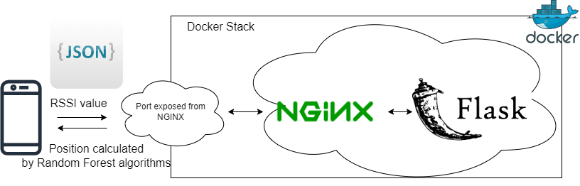

# Random-forest-algorithm-python-flask

A python flask Random forest algorithm to calculate student position.

## Program Structure
---------------------------------------------------------------
Python Flask REST API on Docker for RF calculation​

## Guideline to run the application
---------------------------------------------------------------

Launch a terminal in VSCode.

First, build the Docker image for the Flask application:

`docker build . -t myflaskapp`

Run the following command to start the Docker containers defined in the docker-compose.yaml file:

`docker-compose up` # run docker compose in foreground

Wait for all the containers to start.

- Once the containers are all running, you can access the application in your web browser at http://localhost:10079.
- You can append /predict to access the `/predict` endpoint.

-- To allow to use the method non-localhost port forwarding and ip address(DDNS) are required 
-for doing the post method, it should submit 4 rssi value in json format, for example:

POST http://localhost:10079/predict
Content-Type: application/json; 

{
    "input_data": [ -88,-94.6, -85.2, -78]
}

You may press Ctrl+C to stop the docker-compose stack.

 
